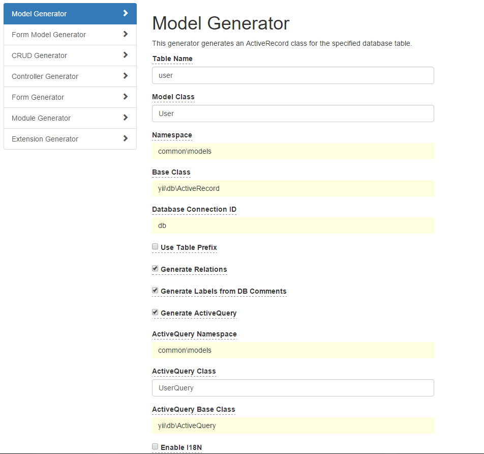
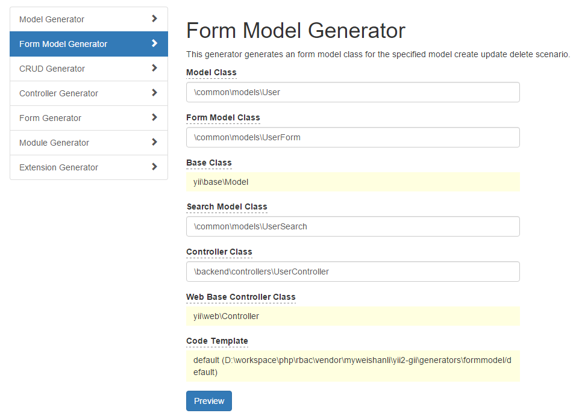

# Yii2 Gii

- 扩展数据模型`ActiveQuery`扩展生成各个字段的基本筛选函数。


- **表单模型** 快速生成 `Create` `Update`  `Delete` 场景，以及 **搜索模型** 列表 和详情数据。


## 1、安装

安装这个扩展的首选方式是通过 [composer](http://getcomposer.org/download/).

执行

``` 
composer require --prefer-dist myweishanli/yii2-gii
```

或添加

``` 
"myweishanli/yii2-gii": "~1.0.0"
```

## 2、配置

`@app/config/main-local.php`

``` php
if (!YII_ENV_TEST) {
    // ...
    $config['modules']['gii'] = [
        'class' => 'yii\gii\Module',
        'generators' => [
            'model' => ['class' => 'wsl\gii\generators\model\Generator'],
            'formmodel' => ['class' => 'wsl\gii\generators\formmodel\Generator'],
        ],
    ];
}
```

## Demo

**SQL:**

``` sql
CREATE TABLE `user` (
  `user_id` int(10) unsigned NOT NULL AUTO_INCREMENT COMMENT '用户id',
  `nickname` varchar(255) CHARACTER SET latin1 NOT NULL COMMENT '昵称',
  `age` int(10) unsigned NOT NULL DEFAULT '0' COMMENT '年龄',
  PRIMARY KEY (`user_id`)
) ENGINE=InnoDB AUTO_INCREMENT=1 DEFAULT CHARSET=utf8;
```

**访问:**

http://{Your domain}/gii/model

或

http://{Your domain}/index.php?r=gii/model


**生成数据模型**




`models\User.php`预览

``` php
<?php

namespace common\models;

use Yii;

/**
 * This is the model class for table "user".
 *
 * @property string $user_id
 * @property string $nickname
 * @property string $age
 */
class User extends \yii\db\ActiveRecord
{
    /**
     * @inheritdoc
     */
    public static function tableName()
    {
        return 'user';
    }

    /**
     * @inheritdoc
     */
    public function rules()
    {
        return [
            [['nickname'], 'required'],
            [['age'], 'integer'],
            [['nickname'], 'string', 'max' => 255]
        ];
    }

    /**
     * @inheritdoc
     */
    public function attributeLabels()
    {
        return [
            'user_id' => '用户id',
            'nickname' => '昵称',
            'age' => '年龄',
        ];
    }

    /**
     * @inheritdoc
     * @return UserQuery the active query used by this AR class.
     */
    public static function find()
    {
        return new UserQuery(get_called_class());
    }
}
```


`models\UserQuery.php`预览代码

``` php
<?php

namespace common\models;

/**
 * This is the ActiveQuery class for [[User]].
 *
 * @see User
 */
class UserQuery extends \yii\db\ActiveQuery
{

    /**
     * Find by `user_id`
     *
     * @param string $userId [[user_id]]
     * @return $this
     */
    public function findByUserId($userId)
    {
        $this->andWhere([
            User::tableName() . '.[[user_id]]' => $userId,
        ]);
        return $this;
    }

    /**
     * Find by like `user_id`
     *
     * @param string $userId [[user_id]]
     * @return $this
     */
    public function findByLikeUserId($userId)
    {
        $this->andWhere([
            'like', User::tableName() . '.[[user_id]]', $userId,
        ]);
        return $this;
    }

    /**
     * Find by like left `user_id`
     *
     * @param string $userId [[user_id]]
     * @return $this
     */
    public function findByLeftLikeUserId($userId)
    {
        $this->andWhere([
            'like', User::tableName() . '.[[user_id]]', '%' . $userId, false
        ]);
        return $this;
    }

    /**
     * Find by like right `user_id`
     *
     * @param string $userId [[user_id]]
     * @return $this
     */
    public function findByRightLikeUserId($userId)
    {
        $this->andWhere([
            'like', User::tableName() . '.[[user_id]]', $userId . '%', false
        ]);
        return $this;
    }

    /**
     * Find by `nickname`
     *
     * @param string $nickname [[nickname]]
     * @return $this
     */
    public function findByNickname($nickname)
    {
        $this->andWhere([
            User::tableName() . '.[[nickname]]' => $nickname,
        ]);
        return $this;
    }

    /**
     * Find by like `nickname`
     *
     * @param string $nickname [[nickname]]
     * @return $this
     */
    public function findByLikeNickname($nickname)
    {
        $this->andWhere([
            'like', User::tableName() . '.[[nickname]]', $nickname,
        ]);
        return $this;
    }

    /**
     * Find by like left `nickname`
     *
     * @param string $nickname [[nickname]]
     * @return $this
     */
    public function findByLeftLikeNickname($nickname)
    {
        $this->andWhere([
            'like', User::tableName() . '.[[nickname]]', '%' . $nickname, false
        ]);
        return $this;
    }

    /**
     * Find by like right `nickname`
     *
     * @param string $nickname [[nickname]]
     * @return $this
     */
    public function findByRightLikeNickname($nickname)
    {
        $this->andWhere([
            'like', User::tableName() . '.[[nickname]]', $nickname . '%', false
        ]);
        return $this;
    }

    /**
     * Find by `age`
     *
     * @param string $age [[age]]
     * @return $this
     */
    public function findByAge($age)
    {
        $this->andWhere([
            User::tableName() . '.[[age]]' => $age,
        ]);
        return $this;
    }

    /**
     * Find by like `age`
     *
     * @param string $age [[age]]
     * @return $this
     */
    public function findByLikeAge($age)
    {
        $this->andWhere([
            'like', User::tableName() . '.[[age]]', $age,
        ]);
        return $this;
    }

    /**
     * Find by like left `age`
     *
     * @param string $age [[age]]
     * @return $this
     */
    public function findByLeftLikeAge($age)
    {
        $this->andWhere([
            'like', User::tableName() . '.[[age]]', '%' . $age, false
        ]);
        return $this;
    }

    /**
     * Find by like right `age`
     *
     * @param string $age [[age]]
     * @return $this
     */
    public function findByRightLikeAge($age)
    {
        $this->andWhere([
            'like', User::tableName() . '.[[age]]', $age . '%', false
        ]);
        return $this;
    }

    /**
     * @inheritdoc
     * @return User[]|array
     */
    public function all($db = null)
    {
        return parent::all($db);
    }

    /**
     * @inheritdoc
     * @return User|array|null
     */
    public function one($db = null)
    {
        return parent::one($db);
    }

}
```


**生成表单模型**




`common\models\UserForm.php`

``` php
<?php

namespace common\models; 

use yii\base\Model; 

/** 
 * This is the Model class for [[User]]. 
 * 
 * @see User
 */ 
class UserForm extends Model
{ 
    /** 
     * 场景 创建 
     */ 
    const SCENARIO_CREATE = 'create'; 
    /** 
     * 场景 更新 
     */ 
    const SCENARIO_UPDATE = 'update'; 
    /** 
     * 场景 更新状态 
     */ 
    const SCENARIO_UPDATE_STATUS = 'updateStatus'; 
    /** 
     * 场景 保存 
     */ 
    const SCENARIO_SAVE = 'save'; 
    /** 
     * 场景 删除 
     */ 
    const SCENARIO_DELETE = 'delete'; 

    /** 
     * @var integer[] 用户id集
     */ 
    public $user_ids = []; 
    /** 
     * @var integer 用户id
     */ 
    public $user_id; 
    /** 
     * @var string 昵称
     */ 
    public $nickname; 
    /** 
     * @var integer 年龄
     */ 
    public $age; 

    /** 
     * @inheritDoc 
     */ 
    public function scenarios() 
    { 
        return [ 
            static::SCENARIO_CREATE => ['nickname', 'age'], 
            static::SCENARIO_UPDATE => ['user_id', 'nickname', 'age'], 
            static::SCENARIO_UPDATE_STATUS => ['user_ids'], 
            static::SCENARIO_SAVE => ['user_id', 'nickname', 'age'], 
            static::SCENARIO_DELETE => ['user_ids'], 
        ]; 
    } 

    /** 
     * @inheritDoc 
     */ 
    public function rules() 
    { 
        return [
            [['user_ids'], 'required', 'on' => [static::SCENARIO_UPDATE_STATUS, static::SCENARIO_DELETE]],
            [['user_id'], 'required', 'on' => [static::SCENARIO_UPDATE]],
            [['nickname'], 'required', 'on' => [static::SCENARIO_CREATE, static::SCENARIO_UPDATE, static::SCENARIO_SAVE]],
            [['age'], 'integer'],
            [['nickname'], 'string', 'max' => 255],
            [['age'], 'default', 'value' => 0],
            [['user_ids'], 'each', 'rule' => ['integer']]
        ]; 
    } 

    /** 
     * @inheritDoc 
     */ 
    public function attributeLabels() 
    { 
        return [ 
            'user_id' => '用户id', 
            'nickname' => '昵称', 
            'age' => '年龄', 
        ]; 
    } 

    /** 
     * 创建 
     * 
     * @return bool 
     */ 
    public function create() 
    { 
        if ($this->validate()) { 
            $userModel = new User(); 
            $userModel->nickname = $this->nickname; 
            $userModel->age = $this->age; 
            if ($userModel->save()) { 
                return true; 
            } else { 
                if ($userModel->hasErrors()) { 
                    $this->addErrors($userModel->errors); 
                } 
            } 
        } 

        return false; 
    } 

    /** 
     * 更新 
     * 
     * @return bool 
     */ 
    public function update() 
    { 
        if ($this->validate()) { 
            $userModel = User::find() 
                ->findByUserId($this->user_id) 
                ->one(); 
            if ($userModel) { 
                $userModel->nickname = $this->nickname; 
                $userModel->age = $this->age; 
                if ($userModel->save()) { 
                    return true; 
                } else { 
                    if ($userModel->hasErrors()) { 
                        $this->addErrors($userModel->errors); 
                    } 
                } 
            } 
        } 

        return false; 
    } 

    /** 
     * 更新状态 
     * 
     * @return bool 
     */ 
    public function updateStatus() 
    { 
        if ($this->validate()) { 
            foreach ($this->user_ids as $user_id) { 
                $userModel = User::find() 
                    ->findByUserId($user_id) 
                    ->one(); 
                if ($userModel) { 
                    if (!$userModel->save()) { 
                        if ($userModel->hasErrors()) { 
                            $this->addErrors($userModel->errors); 
                        } 
                    } 
                } 
            } 
            return true; 
        } 

        return false; 
    } 

    /** 
     * 保存 
     * 
     * @return bool 
     */ 
    public function save() 
    { 
        if ($this->validate()) { 
            if ($this->user_id) { 
                $userModel = User::find() 
                    ->findByUserId($this->user_id) 
                    ->one(); 
            } else { 
                $userModel = new User(); 
            } 
            if ($userModel) { 
                $userModel->nickname = $this->nickname; 
                $userModel->age = $this->age; 
                if ($userModel->save()) { 
                    return true; 
                } else { 
                    if ($userModel->hasErrors()) { 
                        $this->addErrors($userModel->errors); 
                    } 
                } 
            } 
        } 

        return false; 
    } 

    /** 
     * 标记删除状态 
     * 
     * @return bool 
     */ 
    public function delete() 
    { 
        if ($this->validate()) { 
            foreach ($this->user_ids as $user_id) { 
                $userModel = User::find() 
                    ->findByUserId($user_id) 
                    ->one(); 
                if ($userModel) { 
                    if (!$userModel->save()) { 
                        if ($userModel->hasErrors()) { 
                            $this->addErrors($userModel->errors); 
                        } 
                    } 
                } 
            } 
            return true; 
        } 

        return false; 
    } 

    /** 
     * 删除 
     * 
     * @return bool 
     */ 
    /*public function delete() 
    { 
        if ($this->validate()) { 
            foreach ($this->user_ids as $user_id) { 
                $userModel = User::find() 
                    ->findByUserId($user_id) 
                    ->one(); 
                if ($userModel) { 
                    if (!$userModel->delete()) { 
                        if ($userModel->hasErrors()) { 
                            $this->addErrors($userModel->errors); 
                        } 
                    } 
                } 
            } 
            return true; 
        } 

        return false; 
    }*/ 
}
```

`common\models\UserSearch.php`

``` php
<?php

namespace common\models;

use Yii;
use yii\base\Model;
use yii\data\ActiveDataProvider;

/**
 * UserSearch represents the model behind the search form about `\common\models\User`.
 */
class UserSearch extends User
{
    /**
     * @inheritdoc
     */
    public function rules()
    {
        return [
            [['user_id', 'age'], 'integer'],
            [['nickname'], 'safe'],
        ];
    }

    /**
     * @inheritdoc
     */
    public function scenarios()
    {
        // bypass scenarios() implementation in the parent class
        return Model::scenarios();
    }

    /**
     * Creates data provider instance with search query applied
     *
     * @param array $params
     * @param string $formName the form name to be used for loading the data into the model.
     * If not set, [[formName()]] will be used.
     *
     * @return ActiveDataProvider
     */
    public function search($params, $formName = null)
    {
        $query = User::find();

        $dataProvider = new ActiveDataProvider([
            'query' => $query,
        ]);

        $this->load($params, $formName);

        if (!$this->validate()) {
            // uncomment the following line if you do not want to return any records when validation fails
            // $query->where('0=1');
            return $dataProvider;
        }

        $query->andFilterWhere([
            'user_id' => $this->user_id,
            'age' => $this->age,
        ]);

        $query->andFilterWhere(['like', 'nickname', $this->nickname]);

        return $dataProvider;
    }
}
```

`controllers\UserController.php`

``` php
<?php

namespace backend\controllers;

use common\helpers\ExtHelper;
use Yii;
use yii\helpers\ArrayHelper;
use yii\web\MethodNotAllowedHttpException;
use yii\web\NotFoundHttpException;
use yii\filters\VerbFilter;
use yii\web\Response;
use yii\web\Controller;
use common\models\User;
use common\models\UserSearch;
use common\models\UserForm;

/**
 * UserController implements the CRUD actions for User model.
 */
class UserController extends Controller
{
//    public $enableCsrfValidation = false;

    public function behaviors()
    {
        return [
            'verbs' => [
                'class' => VerbFilter::className(),
                'actions' => [
                    'list' => ['get'],
                    'create' => ['post'],
                    'update' => ['post'],
                    'save' => ['post'],
                    'update-status' => ['post'],
                    'delete' => ['post'],
                ],
            ],
        ];
    }

    /**
     * Lists all User models.
     *
     * @return string
     */
    public function actionList()
    {
        $data = [
            'list' => [],
            'total' => 0,
        ];
        $searchModel = new UserSearch();
        $dataProvider = $searchModel->search(Yii::$app->request->queryParams, '');
        $dataProvider->pagination->setPageSize(intval(Yii::$app->request->get('limit')));
        $dataProvider->query->orderBy(ExtHelper::getSort(ArrayHelper::getValue(User::getTableSchema(), 'columns')));
        /** @var User[] $models */
        $models = $dataProvider->getModels();
        $data['total'] = $dataProvider->totalCount;
        foreach ($models as $itemModel) {
            $data['list'][] = $itemModel->toArray();
        }

        $response = Yii::$app->response; 
        $response->format = Response::FORMAT_JSON; 
        $response->data = [ 
            'success' => true, 
            'msg' => '', 
            'data' => $data, 
        ]; 
        return $response;
    }

    /**
     * Displays a single User model.
     *
     * @param integer $user_id
     * @return string
     * @throws NotFoundHttpException
     */
    public function actionDetail($user_id)
    {
        $model = User::find()
            ->findByUserId($user_id)
            ->one();

        if ($model) {
            $data = $model->toArray();
            $response = Yii::$app->response; 
            $response->format = Response::FORMAT_JSON; 
            $response->data = [ 
                'success' => true, 
                'msg' => '', 
                'data' => $data, 
            ]; 
            return $response;
        }

        throw new NotFoundHttpException('数据不存在');
    }

    /**
     * Creates a new User model.
     *
     * @return string
     * @throws MethodNotAllowedHttpException
     */
    public function actionCreate()
    {
        $formModel = new UserForm();

        $formModel->setScenario($formModel::SCENARIO_CREATE);
        if ($formModel->load(Yii::$app->request->post(), '')) {
            if ($formModel->create()) {
                $response = Yii::$app->response; 
                $response->format = Response::FORMAT_JSON; 
                $response->data = [ 
                    'success' => true, 
                    'msg' => '创建成功', 
                ]; 
                return $response;
            } elseif ($formModel->hasErrors()) {
                foreach ($formModel->errors as $field) {
                    foreach ($field as $message) {
                        $response = Yii::$app->response; 
                        $response->format = Response::FORMAT_JSON; 
                        $response->data = [ 
                            'success' => false, 
                            'msg' => $message, 
                        ]; 
                        return $response;
                    }
                }
            }
        }

        throw new MethodNotAllowedHttpException();
    }

    /**
     * Updates an existing User model.
     *
     * @return string
     * @throws MethodNotAllowedHttpException
     */
    public function actionUpdate()
    {
        $formModel = new UserForm();

        $formModel->setScenario($formModel::SCENARIO_UPDATE);
        if ($formModel->load(Yii::$app->request->post(), '')) {
            if ($formModel->update()) {
                $response = Yii::$app->response; 
                $response->format = Response::FORMAT_JSON; 
                $response->data = [ 
                    'success' => true, 
                    'msg' => '更新成功', 
                ]; 
                return $response;
            } elseif ($formModel->hasErrors()) {
                foreach ($formModel->errors as $field) {
                    foreach ($field as $message) {
                        $response = Yii::$app->response; 
                        $response->format = Response::FORMAT_JSON; 
                        $response->data = [ 
                            'success' => false, 
                            'msg' => $message, 
                        ]; 
                        return $response;
                    }
                }
            }
        }

        throw new MethodNotAllowedHttpException();
    }

    /**
     * Updates status an existing Page model.
     *
     * @return string
     * @throws MethodNotAllowedHttpException
     */
    public function actionUpdateStatus()
    {
        $formModel = new UserForm();

        $formModel->setScenario($formModel::SCENARIO_UPDATE_STATUS);
        if ($formModel->load(Yii::$app->request->post(), '')) {
            if ($formModel->updateStatus()) {
                $response = Yii::$app->response; 
                $response->format = Response::FORMAT_JSON; 
                $response->data = [ 
                    'success' => true, 
                    'msg' => '更新成功', 
                ]; 
                return $response;
            } elseif ($formModel->hasErrors()) {
                foreach ($formModel->errors as $field) {
                    foreach ($field as $message) {
                        $response = Yii::$app->response; 
                        $response->format = Response::FORMAT_JSON; 
                        $response->data = [ 
                            'success' => false, 
                            'msg' => $message, 
                        ]; 
                        return $response;
                    }
                }
            }
        }

        throw new MethodNotAllowedHttpException();
    }

    /**
     * Save new or an existing Page model.
     *
     * @return string
     * @throws MethodNotAllowedHttpException
     */
    public function actionSave()
    {
        $formModel = new UserForm();

        $formModel->setScenario($formModel::SCENARIO_SAVE);
        if ($formModel->load(Yii::$app->request->post(), '')) {
            if ($formModel->save()) {
                $response = Yii::$app->response; 
                $response->format = Response::FORMAT_JSON; 
                $response->data = [ 
                    'success' => true, 
                    'msg' => '保存成功', 
                ]; 
                return $response;
            } elseif ($formModel->hasErrors()) {
                foreach ($formModel->errors as $field) {
                    foreach ($field as $message) {
                        $response = Yii::$app->response; 
                        $response->format = Response::FORMAT_JSON; 
                        $response->data = [ 
                            'success' => false, 
                            'msg' => $message, 
                        ]; 
                        return $response;
                    }
                }
            }
        }

        throw new MethodNotAllowedHttpException();
    }

    /**
     * Deletes an existing User model.
     *
     * @return string
     * @throws MethodNotAllowedHttpException
     */
    public function actionDelete()
    {
        $formModel = new UserForm();

        $formModel->setScenario($formModel::SCENARIO_DELETE);
        if ($formModel->load(Yii::$app->request->post(), '')) {
            if ($formModel->delete()) {
                $response = Yii::$app->response; 
                $response->format = Response::FORMAT_JSON; 
                $response->data = [ 
                    'success' => true, 
                    'msg' => '删除成功', 
                ]; 
                return $response;
            } elseif ($formModel->hasErrors()) {
                foreach ($formModel->errors as $field) {
                    foreach ($field as $message) {
                        $response = Yii::$app->response; 
                        $response->format = Response::FORMAT_JSON; 
                        $response->data = [ 
                            'success' => false, 
                            'msg' => $message, 
                        ]; 
                        return $response;
                    }
                }
            }
        }

        throw new MethodNotAllowedHttpException();
    }
}
```


## 更新日志

### Version Dev Master

**计划**

​		- Yii2 ExtJs Rbac CRUD生成


### Version 1.0.1 (2016.2.2)

优化字段类型

增加 **表单模型** **搜索模型** 以及 **控制器** CRUD生成


### Version 1.0.0 (2016.1.11)

- 首个版本